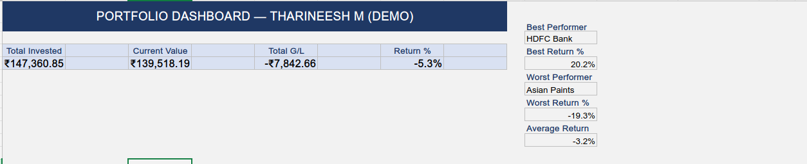
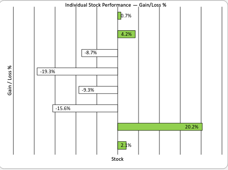
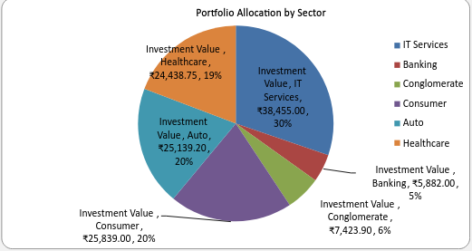

# Personal Investment Portfolio Tracker (Excel)

## Overview
An Excel-based portfolio tracker to monitor equity investment performance, 
visualize sector allocation, and identify best and worst performing holdings.

> **Note:** This is a demo portfolio built for project demonstration.  
> All prices are sourced from NSE India historical data.

## Portfolio Details
- **Period:** FY2025 (April 2024 – March 2025)
- **Holdings:** 8 stocks across 5 sectors
- **Benchmark:** NSE India closing prices (Apr 1, 2024 entry; Mar 31, 2025 exit)

## Features

### Dynamic Price Lookup
Current prices are stored in a central `Price_Reference` sheet.  
Portfolio calculations update automatically when prices are refreshed.  
Formula used: `VLOOKUP` to pull current price by ticker symbol.

### Performance Metrics
For each holding, the tracker calculates:
- Investment Value (Qty × Buy Price)
- Current Value (Qty × Current Price via VLOOKUP)
- Absolute Gain/Loss
- Gain/Loss %
- Portfolio Weight %
- Profit/Loss Status (with conditional formatting)

### Dashboard
- KPI summary: Total invested, current value, total return, return %
- Bar chart: Individual stock gain/loss comparison
- Pie chart: Sector allocation by invested value
- Best and worst performer identification (INDEX-MATCH)

### Sector Allocation
Uses `SUMIF` formula to aggregate portfolio value by sector automatically.

## Excel Formulas Used
| Formula | Purpose |
|---|---|
| VLOOKUP | Dynamic current price lookup from reference sheet |
| SUMIF | Sector-wise allocation calculation |
| INDEX-MATCH | Best and worst stock identification |
| IF + Conditional Formatting | Profit/Loss visual status |
| SUM, AVERAGE, MAX, MIN | Portfolio aggregation metrics |

## Screenshots

## How to Use
1. Download `Demo_Portfolio_Tracker_TharineeshM.xlsx`
2. Open in Microsoft Excel 2016 or later
3. To update prices: Open `Price_Reference` sheet → Update Column B with new prices
4. All calculations and charts update automatically

## Workbook Structure
| Sheet | Purpose |
|---|---|
| Cover | Project overview and disclaimer |
| Portfolio_Input | Raw input: stocks, quantities, buy prices |
| Price_Reference | Current market prices lookup table |
| Portfolio_Calc | All formulas: gain/loss, weights, status |
| Dashboard | Visual summary with 2 charts and KPIs |
| Transactions | Transaction log for all buys |
| Summary | One-page performance overview |
| Methodology | Data sources, formula logic, update instructions |

## About
Prepared by Tharineesh M  
B.Com | SAP S/4HANA Certified Associate — Financial Accounting  
[linkedin.com/in/tharineeshm](https://linkedin.com/in/tharineeshm)
